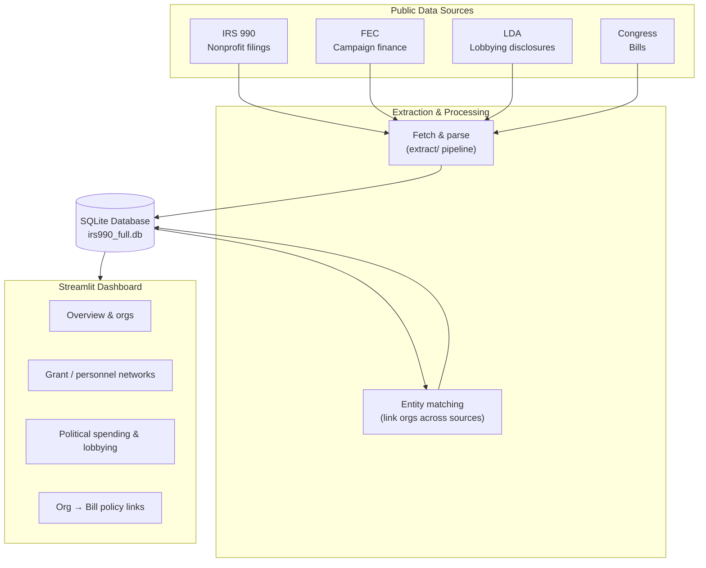

# influence-network
Capstone project investigating the role of the dark money network and its affect on US national policy.

We're pulling together IRS Form 990 filings, FEC campaign finance data, Senate
lobbying disclosures, and Congress.gov bill data to see if we can trace how
money and lobbying actually connect to policy outcomes. See
`influence_network.md` for the full project writeup (motivation, methodology,
data sources, prior work).

## Architecture

High level: pull four public data sources, parse and link them, store everything
in one SQLite database, and explore it through a Streamlit dashboard.



Run the dashboard with `streamlit run app/streamlit_app.py`.
## Setup

```bash
pip install -r requirements.txt
cp .env.example .env   # then fill in your API keys
```

Congress.gov and Senate LDA both work fine without a key at low volume; FEC
falls back to `DEMO_KEY` if you don't set one. See `.env.example` for details.

## Repo layout

- `extract/` - the actual ETL pipeline (collectors for Congress, FEC, LDA,
  and IRS 990 parsing), plus a SQLite schema in `db.py`. Runnable via
  `python -m extract.run <command>` - see the docstring at the top of
  `extract/run.py` for examples.
- `analysis/` - bill-text/lobbying-text alignment (TF-IDF or sentence
  embeddings) and other analysis helpers.
- `notebooks/` - exploratory and demo notebooks (quickstart, extraction
  smoke test, alignment demo, PDF similarity, etc.).
- `test_data_source_connections/` - early one-off notebooks used to poke at
  each API and see what the raw data actually looks like before we built the
  real extractors. See the README in there for more.
- `tests/fixtures/` - small hand-made sample files (e.g. a fake 990 XML) used
  to sanity-check the parsers without needing real bulk data.
- `data/` - gitignored; this is where extracted/downloaded data lands
  locally.


